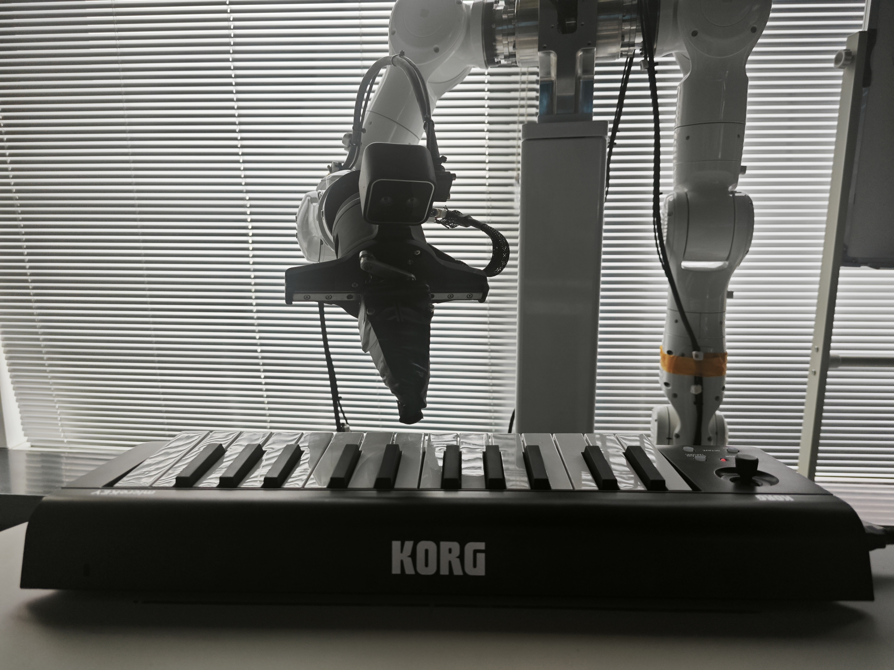
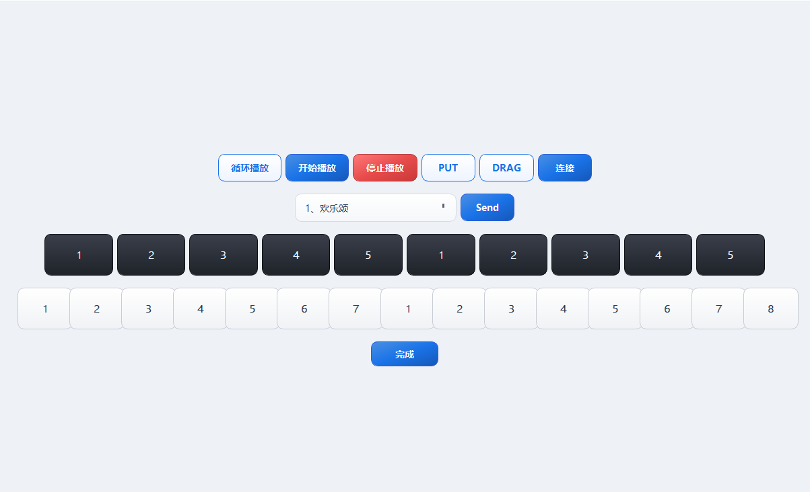

# Demo名称：钢琴艺术家

## 案例图片：

## 使用说明：

本demo是基于天机智能运控SDK版本：10040405下做的，适配的运动控制器版本为10040405

编译：Qt_5_8_0_MinGW_32bit（其他版本也可以）

## 软件操作步骤：

1、点击链接、显示为绿色按钮说明状态正确，橙色状态重新打开重新连

2、点击DRAG,进入拖动模式，没进拖动模式就多点DRAG几次

3、然后就开始标定，拖动到琴键位置就点击对应的按钮，依次点击完成，就点击完成

4、选择曲目后点击send

5、想要循环播放就点击循环播放，只播放一次就就点击开始播放。点击停止播放不会立刻停止运动，需要等曲子弹完才停止。

> 注：步骤3在已经标定过一次后，琴的位置没有变化可以直接点击PUT,然后再点击完成。
> 如果播放失败就打开软件重操作，只要标定过可以不用标定

## 软件界面：

## 目录结构：

- `SDK`：此文档收录未经测试，且并未正式发布的10040405版本SDK
- `piano`：demo源码

## 免责声明：

本demo免费开源，目前是基于10040405版本SDK做的，适配的运动控制器版本为10040405

（若使用较低版本的SDK，直接替换/piano/piano/C_SDK目录下的文件即可，但我们并未进行测试，理论上可以运行；我们不对此事项负责，请须知）

备注：当前正式发布的SDK版本是10040402，运动控制器是10040404；

可联系我们索取未经测试，并未正式发布的控制器版本10040405；

上手使用前请须知：此demo使用若出现什么问题，本公司（天机智能）概不负责，目前仅作为研究开放，我们未经正式测试，感谢！
